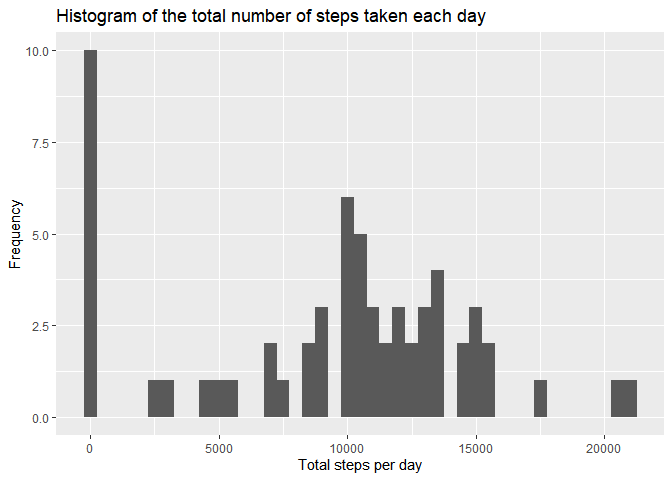
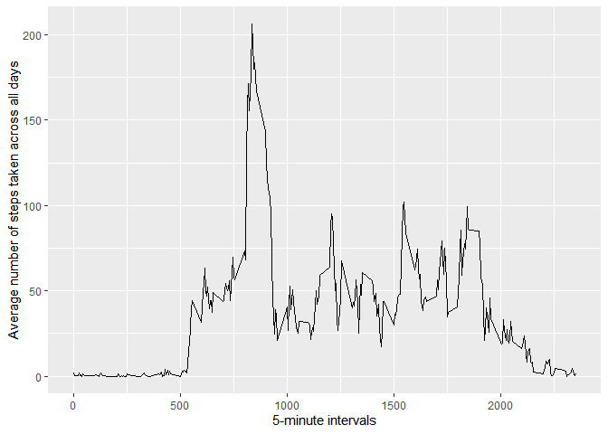
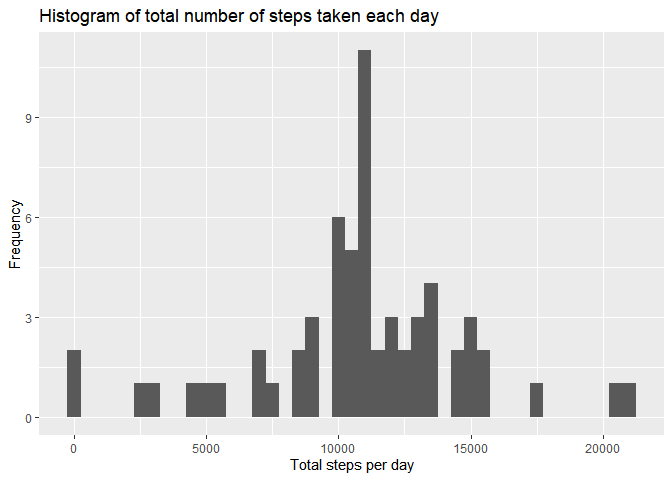
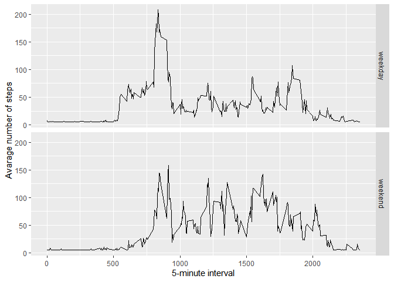

## Loading and preprocessing the data


```r
if(!file.exists("activity.csv")){
    unzip("activity.zip")
}
activity <- read.csv("activity.csv")
```

## What is mean total number of steps taken per day?


```r
library(dplyr)
library(ggplot2)
tot.steps.perday <- activity %>% group_by(date) %>% summarize(stepsperday = sum(steps,na.rm = TRUE ))
qplot(stepsperday, data = tot.steps.perday,xlab="Total steps per day", ylab ="Frequency", main = "Histogram of the total number of steps taken each day", binwidth = 500)
```

<!-- -->

```r
summary <- tot.steps.perday %>% summarize(average = mean(stepsperday, na.rm = TRUE), median = median(stepsperday, na.rm = TRUE))
summary
```

```
## # A tibble: 1 x 2
##   average median
##     <dbl>  <int>
## 1   9354.  10395
```

## What is the average daily activity pattern?

```r
library(dplyr)
library(ggplot2)
daily_pattern <- activity %>% group_by(interval) %>% summarize(average = mean(steps,na.rm = TRUE ))
qplot(interval, average, data = daily_pattern,geom = "line", xlab="5-minute intervals", ylab= "Average number of steps taken across all days")
```

<!-- -->

Which 5-minute interval, on average across all the days in the dataset, contains the maximum number of steps?


```r
daily_pattern[which.max(daily_pattern$average),]
```

```
## # A tibble: 1 x 2
##   interval average
##      <int>   <dbl>
## 1      835    206.
```

## Imputing missing values

##### 1. Calculate and report the total number of missing values in the dataset (i.e. the total number of rows with \color{red}{\verb|NA|}NAs)


```r
sum(is.na(activity$steps))
```

```
## [1] 2304
```

##### 2.Devise a strategy for filling in all of the missing values in the dataset.
##### 3.Create a new dataset that is equal to the original dataset but with the missing data filled in.


```r
library(Hmisc)
imputed<- activity  
imputed$steps <- impute(activity$steps, fun = mean)
```

## Histogram of the total number of steps taken each day 

```r
imputedsteps <- tapply(imputed$steps,imputed$date, sum)
qplot(imputedsteps, xlab= "Total steps per day" , binwidth = 500, ylab = "Frequency",main = "Histogram of total number of steps taken each day" )
```

<!-- -->

##### 1. Calculate and report the mean and median total number of steps taken per day.

```r
mean <- mean(imputedsteps)
mean
```

```
## [1] 10766.19
```

```r
median <- median(imputedsteps)
median
```

```
## [1] 10766.19
```

## Are there differences in activity patterns between weekdays and weekends?

##### 1. Create a new factor variable in the dataset with two levels – “weekday” and “weekend” indicating whether a given date is a weekday or weekend day.


```r
imputed$datefactor <-  ifelse(as.POSIXlt(imputed$date)$wday %in% c(0,6), 'weekend', 'weekday')
```

##### 2. Make a panel plot containing a time series plot (i.e. type=“l”) of the 5-minute interval (x-axis) and the average number of steps taken, averaged across all weekday days or weekend days (y-axis).


```r
averageimputed <- aggregate(steps ~ interval + datefactor, data=imputed, "mean")

ggplot(averageimputed, aes(interval, steps)) + 
    geom_line() + 
    facet_grid(datefactor ~ .) +
    xlab("5-minute interval") + 
    ylab("Avarage number of steps")
```

<!-- -->


